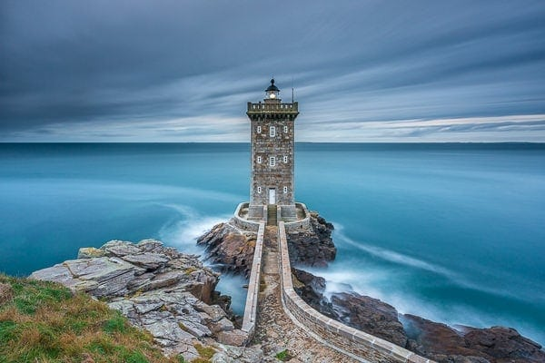
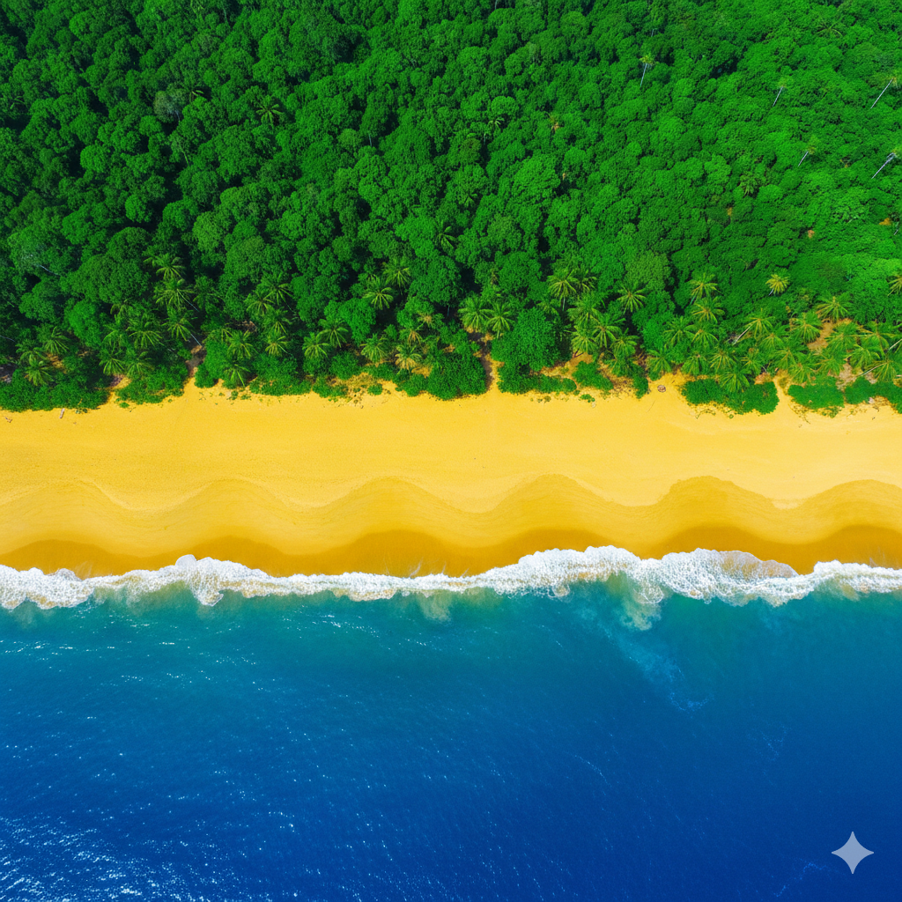
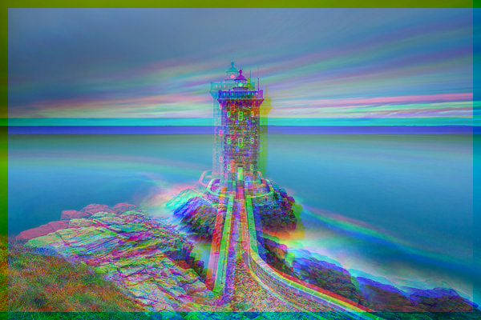

|Attenzione|
|----------|
|Per leggere correttamente questo documento, click destro su ESERCIZIO.md e selezionare Open Preview.|

# Filtri per Immagini
Implementiamo dei filtri per la manipolazione di immagini, utilizzando matrici per la memorizzazione dei dati RGB.

## Il problema
Lo scopo di questo esercizio è implementare diversi filtri per la manipolazione di immagini digitali. Un'immagine digitale è composta da pixel, e ogni pixel è rappresentato da tre valori: Rosso (R), Verde (G) e Blu (B), ognuno con valori da 0 a 255. Manipolando questi valori puoi creare effetti artistici e filtri di vario tipo.

Utilizzeremo tre matrici bidimensionali separate per memorizzare i valori R, G e B di ogni pixel dell'immagine. Ogni posizione [i][j] nelle matrici rappresenta lo stesso pixel.

Ecco alcuni esempi di filtri che implementeremo:

**Immagine originale (faro.png):**



**Filtro Rosso:**


**Filtro Bianco e Nero:**


**Immagine originale (foto_aerea.png):**



**Filtro Vegetazione:**


## L'analisi e la strategia risolutiva
* Caricare un'immagine e separare i suoi componenti in tre matrici: R (rosso), G (verde), B (blu).
* Applicare trasformazioni matematiche sui valori delle matrici per ottenere effetti visivi.
* Salvare il risultato come nuova immagine.

Implementeremo i seguenti filtri:
* *filtroRosso*: Elimina le componenti Verde e Blu, lasciando solo il Rosso.
* *filtroBW*: Converte l'immagine in bianco e nero calcolando la media dei tre canali.
* *filtroCentro*: Applica un effetto vignetta, dove i pixel vicini al centro sono più luminosi.
* *filtroGlitch*: Crea un effetto glitch sfasando i canali rosso e blu.
* *filtroMare*: Evidenzia solo i pixel blu (mare) oscurando il resto.
* *filtroSpiaggia*: Evidenzia solo i pixel gialli (spiaggia) oscurando il resto.
* *filtroVegetazione*: Evidenzia solo i pixel verdi (vegetazione) oscurando il resto.

## Implementazione della soluzione

### Il Main: struttura e utilizzo

Nel file *Esercizio.java* è già presente uno scheletro del metodo *main* che si occupa di:
1. Caricare un'immagine dalla cartella `immagini/` e separare i canali R, G, B in tre matrici.
2. Visualizzare le dimensioni dell'immagine.
3. Chiamare la funzione filtro (da implementare).
4. Salvare l'immagine risultante.

Lo scheletro del main è il seguente:

```Java
public static void main(String args[]) {

    try {
        //Attiva qui uno dei due file immagine da leggere:
        String nomeFileIn = "faro";
        //String nomeFileIn = "foto_aerea";

        //Conversione dell'immagine in matrici parallele R, G, B
        ImageRGB.RGB rgb = ImageRGB.extractRGB("immagini/" + nomeFileIn + ".png");
        int[][] R = rgb.R();
        int[][] G = rgb.G();
        int[][] B = rgb.B();

        //Qui R, G, B contengono i livelli di rosso, verde, blu per ogni pixel.
        //I valori vanno da 0 a 255, da bassa intensità ad alta intensità.
        System.out.println("Dimensione immagine: " + R.length+ "x" + R[0].length );

        //Chiama qui la funzione filtro, passando come parametri le matrici R,G,B da modificare, ad es.:
        //filtroRosso(R, G, B);
        //___

        //Assegna il nome del file di output (immagine con filtro), ad es. "faro_rosso.png":
        String nomeFileOut = "___";

        ImageRGB.writeRGB(R, G, B, nomeFileOut);
 
    } catch( Exception e) {
        e.printStackTrace();
    }
}
```

**Per ogni filtro, dovrai:**
1. Implementare la funzione filtro (il cui prototipo è già presente nel file).
2. Completare il main specificando:
   - Il file di input corretto (`"faro"` o `"foto_aerea"`).
   - La chiamata alla funzione filtro.
   - Il nome del file di output.
3. Eseguire il programma e verificare che l'immagine prodotta corrisponda al risultato atteso.

<hr/>

### Filtro Rosso

Nel file *Esercizio.java*, completa il contenuto della funzione *filtroRosso*, che elimina le componenti Verde e Blu dall'immagine, lasciando solo il canale Rosso.

La funzione deve avere i seguenti parametri:
* Parametri di input/output: matrici R, G, B che rappresentano i canali dell'immagine.
* Parametri di output: nessuno (le matrici vengono modificate direttamente).

**Immagine di input:** `faro.png`

**Risultato atteso:**


<hr/>
<details>
  <summary>Solo dopo aver svolto l'esercizio, apri qui per vedere la soluzione</summary>

**Funzione filtroRosso:**
```Java
//Elimina le componenti Verde e Blu, lasciando solo il Rosso
public static void filtroRosso( int[][] R, int[][] G, int[][] B ) {
    for ( int i=0; i<G.length; ++i ) {
        for ( int j=0; j<G[0].length; ++j ) {
            G[i][j] = 0;
            B[i][j] = 0;
        }
    }
}
```

**Nel main:**
```Java
...
String nomeFileIn = "faro";
...
filtroRosso(R, G, B);
String nomeFileOut = nomeFileIn + "_rosso.png";
...
```
</details>
<hr/>

### Filtro Bianco e Nero

Nel file *Esercizio.java*, completa il contenuto della funzione *filtroBW*, che converte l'immagine in bianco e nero. Per ottenere il bianco e nero, ogni pixel deve avere lo stesso valore per R, G e B, calcolato come la media dei tre valori originali.

La funzione deve avere i seguenti parametri:
* Parametri di input/output: matrici R, G, B che rappresentano i canali dell'immagine.
* Parametri di output: nessuno (le matrici vengono modificate direttamente).

**Immagine di input:** `faro.png`

**Risultato atteso:**


<hr/>
<details>
  <summary>Solo dopo aver svolto l'esercizio, apri qui per vedere la soluzione</summary>

**Funzione filtroBW:**
```Java
//Bianco e nero: R, G, B impostati alla media dei valori
public static void filtroBW( int[][] R, int[][] G, int[][] B ) {
    for ( int i=0; i<G.length; ++i ) {
        for ( int j=0; j<G[0].length; ++j ) {
            int media = (R[i][j] + G[i][j] + B[i][j]) / 3;
            R[i][j] = media;
            G[i][j] = media;
            B[i][j] = media;
        }
    }
}
```

**Nel main:**
```Java
...
String nomeFileIn = "faro";
...
filtroBW(R, G, B);
String nomeFileOut = nomeFileIn + "_bianco_nero.png";
...
```
</details>
<hr/>

### Filtro Centro (Vignetta)

Nel file *Esercizio.java*, completa il contenuto della funzione *filtroCentro*, che applica un effetto vignetta: i pixel vicino al centro dell'immagine mantengono la loro luminosità, mentre quelli più lontani vengono progressivamente oscurati.

L'algoritmo deve:
1. Calcolare il centro dell'immagine.
2. Calcolare la distanza massima possibile dal centro.
3. Per ogni pixel, calcolare la sua distanza dal centro.
4. Moltiplicare i valori RGB per un fattore che va da 1.0 (al centro) a 0.0 (ai bordi).

La funzione deve avere i seguenti parametri:
* Parametri di input/output: matrici R, G, B che rappresentano i canali dell'immagine.
* Parametri di output: nessuno (le matrici vengono modificate direttamente).

**Immagine di input:** `faro.png`

**Risultato atteso:**


<hr/>
<details>
  <summary>Solo dopo aver svolto l'esercizio, apri qui per vedere la soluzione</summary>

**Funzione filtroCentro:**
```Java
//I pixel vicino al centro hanno più luminosità
public static void filtroCentro(int[][] R, int[][] G, int[][] B) {
    int centroI = G.length / 2;
    int centroJ = G[0].length / 2;
    double distanzaMax = Math.sqrt( centroI*centroI + centroJ*centroJ);
    for ( int i=0; i<G.length; ++i ) {
        for ( int j=0; j<G[0].length; ++j ) {
            double di = Math.abs(i - centroI);
            double dj = Math.abs(j - centroJ);
            double distanza = Math.sqrt(di*di + dj*dj);
            
            //distanzaFattore:
            //se la distanza è massima ==> vale 0.0 
            //se la distanza è minima ==> vale 1.0 
            double distanzaFattore = 1.0 - (distanza/distanzaMax);

            //Modifico il valore del pixel considerando il fattore
            R[i][j] *= distanzaFattore; 
            G[i][j] *= distanzaFattore; 
            B[i][j] *= distanzaFattore; 
        }
    }
}
```

**Nel main:**
```Java
...
String nomeFileIn = "faro";
...
filtroCentro(R, G, B);
String nomeFileOut = nomeFileIn + "_centro.png";
...
```
</details>
<hr/>

### Combinazione di Filtri: Bianco e Nero + Centro

È possibile combinare più filtri per ottenere effetti composti. Ad esempio, applicando prima il filtro bianco e nero e poi il filtro centro, si ottiene un'immagine in bianco e nero con effetto vignetta.

**Immagine di input:** `faro.png`

**Risultato atteso:**


**Nel main:**
```Java
...
String nomeFileIn = "faro";
...
filtroBW(R, G, B);
filtroCentro(R, G, B);
String nomeFileOut = nomeFileIn + "_bianco_nero_centro.png";
...
```

<hr/>

### Filtro Glitch

Nel file *Esercizio.java*, completa il contenuto della funzione *filtroGlitch*, che crea un effetto "glitch" tipico delle interferenze digitali. L'effetto si ottiene sfasando spazialmente i canali rosso e blu: il rosso viene spostato in alto a sinistra, il blu in basso a destra.

L'algoritmo deve:
1. Creare copie delle matrici R e B originali.
2. Azzerare le matrici R e B.
3. Per ogni pixel, copiare il valore rosso originale in una posizione spostata (in alto a sinistra).
4. Per ogni pixel, copiare il valore blu originale in una posizione spostata (in basso a destra).
5. Verificare che le nuove posizioni siano dentro i limiti dell'immagine.

La funzione deve avere i seguenti parametri:
* Parametri di input/output: matrici R, G, B che rappresentano i canali dell'immagine.
* Parametri di output: nessuno (le matrici vengono modificate direttamente).

**Immagine di input:** `faro.png`

**Risultato atteso:**



<hr/>
<details>
  <summary>Solo dopo aver svolto l'esercizio, apri qui per vedere la soluzione</summary>

**Funzione filtroGlitch:**
```Java
//Effetto glitch (rosso e blu sfasati)
public static void filtroGlitch(int[][] R, int[][] G, int[][] B) {
    
    //Salvo rosso e blu originali in delle copie, in modo da 
    // poterli ricreare completamente da zero.
    int righe = R.length;
    int colonne = R[0].length;
    int[][] R_orig = new int[righe][colonne];
    int[][] B_orig = new int[righe][colonne];
    
    for ( int i=0; i<R.length; ++i ) {
        for ( int j=0; j<R[0].length; ++j ) {
            R_orig[i][j] = R[i][j];
            B_orig[i][j] = B[i][j];
            R[i][j] = 0;
            B[i][j] = 0;
        }
    }

    //Sposto i pixel rossi più in alto a sinistra
    //Sposto i pixel blu più in basso a destra
    int spostamento = 10; //10 pixel di spiazzamento
    for ( int i=0; i<righe; ++i ) {
        for ( int j=0; j<colonne; ++j ) {
            int iNewRosso = i - spostamento;
            int jNewRosso = j - spostamento;

            int iNewBlu = i + spostamento;
            int jNewBlu = j + spostamento;

            if (iNewRosso >=0 && jNewRosso >= 0) {
                R[iNewRosso][jNewRosso] = R_orig[i][j];
            }
            if (iNewBlu < righe  && jNewBlu < colonne) {
                B[iNewBlu][jNewBlu] = B_orig[i][j];
            }
        }
    }

}
```

**Nel main:**
```Java
...
String nomeFileIn = "faro";
...
filtroGlitch(R, G, B);
String nomeFileOut = nomeFileIn + "_glitch.png";
...
```
</details>
<hr/>

### Filtro Mare

Nel file *Esercizio.java*, completa il contenuto della funzione *filtroMare*, che evidenzia solo i pixel che rappresentano il mare (prevalenza di blu) oscurando tutto il resto.

Un pixel è considerato "mare" se:
* Il valore Rosso è minore di 127
* Il valore Verde è minore di 127
* Il valore Blu è maggiore o uguale a 127

La funzione deve avere i seguenti parametri:
* Parametri di input/output: matrici R, G, B che rappresentano i canali dell'immagine.
* Parametri di output: nessuno (le matrici vengono modificate direttamente).

**Immagine di input:** `foto_aerea.png`

**Risultato atteso:**


<hr/>
<details>
  <summary>Solo dopo aver svolto l'esercizio, apri qui per vedere la soluzione</summary>

**Funzione filtroMare:**
```Java
//Oscura i pixel che non sono Mare (prevalenza blu)
public static void filtroMare(int[][] R, int[][] G, int[][] B) {
    for ( int i=0; i<G.length; ++i ) {
        for ( int j=0; j<G[0].length; ++j ) {
            if ( R[i][j] < 127 && G[i][j] < 127 && B[i][j] >= 127 ) {
                ;
            } else {
                R[i][j] = 0; 
                G[i][j] = 0; 
                B[i][j] = 0; 
            }
        }
    }
}
```

**Nel main:**
```Java
...
String nomeFileIn = "foto_aerea";
...
filtroMare(R, G, B);
String nomeFileOut = nomeFileIn + "_mare.png";
...
```
</details>
<hr/>

### Filtro Spiaggia

Nel file *Esercizio.java*, completa il contenuto della funzione *filtroSpiaggia*, che evidenzia solo i pixel che rappresentano la spiaggia (prevalenza di giallo, cioè rosso + verde alti) oscurando tutto il resto.

Un pixel è considerato "spiaggia" se:
* Il valore Rosso è maggiore o uguale a 127
* Il valore Verde è maggiore o uguale a 127
* Il valore Blu è minore di 127

La funzione deve avere i seguenti parametri:
* Parametri di input/output: matrici R, G, B che rappresentano i canali dell'immagine.
* Parametri di output: nessuno (le matrici vengono modificate direttamente).

**Immagine di input:** `foto_aerea.png`

**Risultato atteso:**


<hr/>
<details>
  <summary>Solo dopo aver svolto l'esercizio, apri qui per vedere la soluzione</summary>

**Funzione filtroSpiaggia:**
```Java
//Oscura i pixel che non sono Spiaggia (prevalenza giallo)
public static void filtroSpiaggia(int[][] R, int[][] G, int[][] B) {
    for ( int i=0; i<G.length; ++i ) {
        for ( int j=0; j<G[0].length; ++j ) {
            if ( R[i][j] >= 127 && G[i][j] >= 127 && B[i][j] < 127 ) {
                ;
            } else {
                R[i][j] = 0; 
                G[i][j] = 0; 
                B[i][j] = 0; 
            }
        }
    }
}
```

**Nel main:**
```Java
...
String nomeFileIn = "foto_aerea";
...
filtroSpiaggia(R, G, B);
String nomeFileOut = nomeFileIn + "_spiaggia.png";
...
```
</details>
<hr/>

### Filtro Vegetazione

Nel file *Esercizio.java*, completa il contenuto della funzione *filtroVegetazione*, che evidenzia solo i pixel che rappresentano la vegetazione (prevalenza di verde) oscurando tutto il resto.

Un pixel è considerato "vegetazione" se:
* Il valore Rosso è minore di 100
* Il valore Verde è maggiore o uguale a 100
* Il valore Blu è minore di 100

La funzione deve avere i seguenti parametri:
* Parametri di input/output: matrici R, G, B che rappresentano i canali dell'immagine.
* Parametri di output: nessuno (le matrici vengono modificate direttamente).

**Immagine di input:** `foto_aerea.png`

**Risultato atteso:**


<hr/>
<details>
  <summary>Solo dopo aver svolto l'esercizio, apri qui per vedere la soluzione</summary>

**Funzione filtroVegetazione:**
```Java
//Oscura i pixel che non sono Vegetazione (prevalenza verde)
public static void filtroVegetazione(int[][] R, int[][] G, int[][] B) {
    for ( int i=0; i<G.length; ++i ) {
        for ( int j=0; j<G[0].length; ++j ) {
            if ( R[i][j] < 100 && G[i][j] >= 100 && B[i][j] < 100 ) {
                ;
            } else {
                R[i][j] = 0; 
                G[i][j] = 0; 
                B[i][j] = 0; 
            }
        }
    }
}
```

**Nel main:**
```Java
...
String nomeFileIn = "foto_aerea";
...
filtroVegetazione(R, G, B);
String nomeFileOut = nomeFileIn + "_vegetazione.png";
...
```
</details>
<hr/>


## Esercizi aggiuntivi: crea il tuo filtro!

Ora che hai acquisito familiarità con la manipolazione delle matrici RGB, prova a inventare e implementare un filtro personalizzato. Ecco alcune idee da cui prendere spunto:

* **Filtro Negativo**: Inverti i colori dell'immagine sottraendo ogni valore RGB da 255.
* **Filtro Seppia**: Crea un effetto "foto antica" applicando una formula che combina i canali RGB in tonalità marroni/giallastre.
* **Filtro Specchio**: Rifletti l'immagine orizzontalmente o verticalmente.
* **Filtro Pixelato**: Riduci la risoluzione dell'immagine raggruppando i pixel in blocchi e assegnando a tutti lo stesso colore medio.
* **Filtro Luminosità**: Aumenta o diminuisci la luminosità di tutti i pixel di un fattore costante.
* **Filtro Contrasto**: Amplifica le differenze tra pixel chiari e scuri.
* **Filtro Sfocatura**: Calcola per ogni pixel la media dei valori dei pixel vicini.
* **Filtro Cielo**: Evidenzia solo i pixel azzurri (cielo) oscurando il resto.

Per ogni filtro che crei:
1. Definisci la funzione con il prototipo appropriato.
2. Implementa l'algoritmo di trasformazione.
3. Aggiorna il main per testare il nuovo filtro.
4. Salva l'immagine risultante e verifica l'effetto ottenuto.

